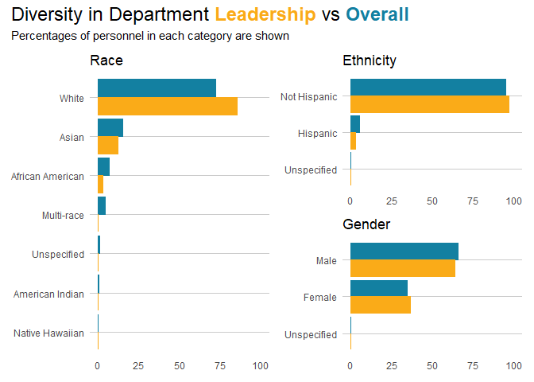
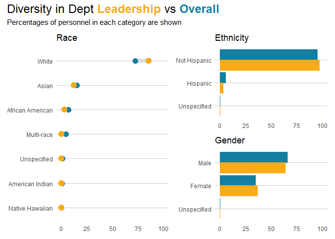

Recently, a friend asked me to make a simple data visualization for her. The dataset was tiny and, to be honest, not super interesting (a very simple survey of [not very much] diversity among her department's leadership and overall membership). But the nice thing about a simple dataset is that for once I could spend less time on data cleaning and more time playing with aesthetics.

Here are the libraries I used:


```r
library(tidyverse)
library(readxl)
library(ggalt)
library(patchwork)
library(ggtext)
```

### Data Wrangling

The data I was given was an Excel sheet that looked like this:


 
I started by doing a bit of data cleanup in Excel. If the dataset had been larger, I might have tried using {readxl} to clean it up in R, but in this case it took about 30 seconds to do it in Excel.

I separated each table onto a different tab, added a "personnel" header (for "Overall" vs "Leadership" categories), and corrected the typo in Race ("Indian~~a~~").

I next used the {readxl} package to import the Excel data... 


```r
# specify path of original data
path <- "blog_data.xlsx"

# read in all sheets as a named list
data <- path %>% 
  excel_sheets() %>% 
  set_names() %>% 
  map(read_xlsx, path = path)

# split list into separate dataframes
list2env(data, .GlobalEnv)
```

...And now I have three little dataframes.


Table: ethnicity

|personnel       | Hispanic| Not Hispanic|Unsp |
|:---------------|--------:|------------:|:----|
|Dept Overall    |    0.054|        0.946|1E-3 |
|Dept Leadership |    0.030|        0.970|NA   |

<table class="table" style="width: auto !important; ">
<caption>gender</caption>
 <thead>
  <tr>
   <th style="text-align:left;"> personnel </th>
   <th style="text-align:right;"> Female </th>
   <th style="text-align:right;"> Male </th>
   <th style="text-align:right;"> Unsp </th>
  </tr>
 </thead>
<tbody>
  <tr>
   <td style="text-align:left;"> Dept Overall </td>
   <td style="text-align:right;"> 0.346 </td>
   <td style="text-align:right;"> 0.654 </td>
   <td style="text-align:right;"> 0 </td>
  </tr>
  <tr>
   <td style="text-align:left;"> Dept Leadership </td>
   <td style="text-align:right;"> 0.364 </td>
   <td style="text-align:right;"> 0.636 </td>
   <td style="text-align:right;"> 0 </td>
  </tr>
</tbody>
</table>

<table class="table" style="width: auto !important; ">
<caption>race</caption>
 <thead>
  <tr>
   <th style="text-align:left;"> personnel </th>
   <th style="text-align:right;"> White </th>
   <th style="text-align:right;"> African American </th>
   <th style="text-align:left;"> American Indian </th>
   <th style="text-align:right;"> Asian </th>
   <th style="text-align:left;"> Native Hawaiian </th>
   <th style="text-align:left;"> Multi-race </th>
   <th style="text-align:left;"> Unsp </th>
  </tr>
 </thead>
<tbody>
  <tr>
   <td style="text-align:left;"> Dept Overall </td>
   <td style="text-align:right;"> 0.72 </td>
   <td style="text-align:right;"> 0.066 </td>
   <td style="text-align:left;"> 6.0000000000000001E-3 </td>
   <td style="text-align:right;"> 0.152 </td>
   <td style="text-align:left;"> 2E-3 </td>
   <td style="text-align:left;"> 4.2000000000000003E-2 </td>
   <td style="text-align:left;"> 1.2E-2 </td>
  </tr>
  <tr>
   <td style="text-align:left;"> Dept Leadership </td>
   <td style="text-align:right;"> 0.85 </td>
   <td style="text-align:right;"> 0.030 </td>
   <td style="text-align:left;"> NA </td>
   <td style="text-align:right;"> 0.120 </td>
   <td style="text-align:left;"> NA </td>
   <td style="text-align:left;"> NA </td>
   <td style="text-align:left;"> NA </td>
  </tr>
</tbody>
</table>

Next up: tidying each dataframe (yes, I copied and pasted more than twice and therefore should have written some functions, but again I was in a hurry to get to the fun part).

Here's what I did for the `ethnicity` dataframe, which I repeated for `gender` and `race`.

```r
ethnicity <- ethnicity %>%
  
  # convert all columns except personnel to numeric
  mutate_at(vars(-personnel), as.numeric) %>% 
  
  # make it tidy (i.e. long) format
  pivot_longer(-personnel, names_to = "ethnicity", values_to = "percent") %>% 
  
  # convert decimals to percentages; convert `ethnicity` and `personnel` to factors
  mutate(percent = percent * 100,
         ethnicity = as.factor(str_replace(ethnicity, "Unsp", "Unspecified")),
         personnel = as.factor(personnel)) %>% 
  
  # replace NAs with 0 (after confirming with my friend that this was the intent)
  replace_na(list(percent = 0))
```


<table class="table" style="width: auto !important; margin-left: auto; margin-right: auto;">
<caption>ethnicity</caption>
 <thead>
  <tr>
   <th style="text-align:left;"> personnel </th>
   <th style="text-align:left;"> ethnicity </th>
   <th style="text-align:right;"> percent </th>
  </tr>
 </thead>
<tbody>
  <tr>
   <td style="text-align:left;"> Dept Overall </td>
   <td style="text-align:left;"> Hispanic </td>
   <td style="text-align:right;"> 5.4 </td>
  </tr>
  <tr>
   <td style="text-align:left;"> Dept Overall </td>
   <td style="text-align:left;"> Not Hispanic </td>
   <td style="text-align:right;"> 94.6 </td>
  </tr>
  <tr>
   <td style="text-align:left;"> Dept Overall </td>
   <td style="text-align:left;"> Unspecified </td>
   <td style="text-align:right;"> 0.1 </td>
  </tr>
  <tr>
   <td style="text-align:left;"> Dept Leadership </td>
   <td style="text-align:left;"> Hispanic </td>
   <td style="text-align:right;"> 3.0 </td>
  </tr>
  <tr>
   <td style="text-align:left;"> Dept Leadership </td>
   <td style="text-align:left;"> Not Hispanic </td>
   <td style="text-align:right;"> 97.0 </td>
  </tr>
  <tr>
   <td style="text-align:left;"> Dept Leadership </td>
   <td style="text-align:left;"> Unspecified </td>
   <td style="text-align:right;"> 0.0 </td>
  </tr>
</tbody>
</table>

### Data Visualization

Now for the fun stuff! There's a whole universe of {ggplot2} extensions, many (but not all) of which are listed [here](https://exts.ggplot2.tidyverse.org/).

I picked a few that I had been wanting to play with: [{bbplot}](https://bbc.github.io/rcookbook/) for theme, [{ggalt}](https://github.com/hrbrmstr/ggalt) for dumbbell plots, [{patchwork}](https://patchwork.data-imaginist.com/) to arrange plots, and [{ggtext}](https://wilkelab.org/ggtext/) for HTML text styling.

I started by setting up a custom theme for my plots -- largely borrowed from the BBC's [{bbplot}](https://bbc.github.io/rcookbook/#how_to_create_bbc_style_graphics) package.

The preset theme can be applied directly as a `ggplot` layer using `bbplot::bbc_style()`, but I made some tweaks and saved it as `my_theme`. 


```r
my_colors <- c("#FAAB18", "#1380A1")

my_theme <- theme_light() +
  theme(axis.ticks = element_blank(), 
        axis.line = element_blank(), 
        panel.grid.minor = element_blank(),
        panel.grid.major.y = element_line(color = "#cbcbcb"),
        panel.grid.major.x = element_blank(), 
        panel.background = element_blank(),
        panel.border = element_blank())

theme_set(my_theme)
```

Now I create each bar plot (for Gender, Ethnicity, and Race) separately.

* Reorder gender by percent
* Set y axis 0-100 so all plots have the same range
* Use custom colors (from `bbplot::bbc_style`)
* Use `color` in bars (in addition to `fill`) so 0 shows as a line


```r
p1 <- ethnicity %>%
  mutate(ethnicity = fct_reorder(ethnicity, percent, na.rm = T)) %>% 
  ggplot(aes(x = ethnicity, y = percent, fill = personnel, color = personnel)) +
  geom_col(position = "dodge") +
  coord_flip(ylim = c(0, 100)) +
  ggtitle("Ethnicity") +
  xlab(NULL) +
  ylab(NULL) +
  scale_fill_manual(values = my_colors) +
  scale_color_manual(values = my_colors)

p2 <- gender %>%
  mutate(gender = fct_reorder(gender, percent)) %>% 
  ggplot(aes(x = gender, y = percent, fill = personnel, color = personnel)) +
  geom_col(position = "dodge") +
  coord_flip(ylim = c(0, 100)) +
  ggtitle("Gender") +
  xlab(NULL) +
  ylab(NULL) +
  scale_fill_manual(values = my_colors) +
  scale_color_manual(values = my_colors)

p3 <- race %>%
  mutate(race = fct_reorder(race, percent, na.rm = T)) %>% 
  ggplot(aes(x = race, y = percent, fill = personnel, color = personnel)) + 
  geom_col(position = "dodge") +
  coord_flip(ylim = c(0, 100)) +
  ggtitle("Race") +
  xlab(NULL) +
  ylab(NULL) +
  scale_fill_manual(values = my_colors) +
  scale_color_manual(values = my_colors)
```

Then I use {patchwork} to stitch them together, and {ggtext} to add color to the title in lieu of a legend.

* "Collect" guides so legends from each plot are treated the same (ie. deleted)
* Use {ggtext} `element_textbox_simple` or `element_markdown` to allow html in title


```r
p3 + (p1 / p2) +
  plot_layout(guides = "collect") +
  plot_annotation(title = "<span style='font-size:18pt'>Diversity in Department <b style='color:#FAAB18;'>Leadership</b> vs <b style='color:#1380A1;'>Overall</b></span>",
                  subtitle = "Percentages of personnel in each category are shown",
                  theme = theme(plot.title = element_markdown(lineheight = 1.1))) &
  theme(legend.position = "none")
```

<!-- -->


I also repeated the above, but with Race shown in a dumbbell plot:


```r
p4 <- race %>%
  mutate(race = fct_reorder(race, percent, na.rm = T)) %>%
  pivot_wider(names_from = personnel, values_from = percent) %>% 
  ggplot() +
  geom_dumbbell(aes(x = `Dept Overall`, xend = `Dept Leadership`, y = race),
                size = 3, 
                colour = "#dddddd", 
                colour_x = "#1380A1", 
                colour_xend = "#FAAB18",
                show.legend = F) +
  coord_cartesian(xlim = c(0,100)) +
  ggtitle("Race") +
  xlab(NULL) +
  ylab(NULL)
```

And here's the patchwork:


```r
p4 + (p1 / p2) +
  plot_layout(guides = "collect") +
  plot_annotation(title = "<span style='font-size:18pt'>Diversity in Dept <b style='color:#FAAB18;'>Leadership</b> vs <b style='color:#1380A1;'>Overall</b></span>",
                  subtitle = "Percentages of personnel in each category are shown",
                  theme = theme(plot.title = element_markdown(lineheight = 1.1))) &
  theme(legend.position = "none")
```

<!-- -->


### BONUS TIP!

Thanks to [this](https://jozef.io/r909-rmarkdown-tips/) helpful post, I discovered that you can use xaringan's Infinite Moon Reader to get live previews of RMarkdown documents (not just xaringan slides!).  

After installing [{xaringan}](https://github.com/yihui/xaringan), you can either run `xaringan:::inf_mr()` or select "Infinite Moon Reader" from the RStudio Addins drop-down menu.

The preview will appear in the RStudio Viewer pane, and it will refresh every time you save changes to your Rmd. So much better than knitting every time you want to check your formatting!

